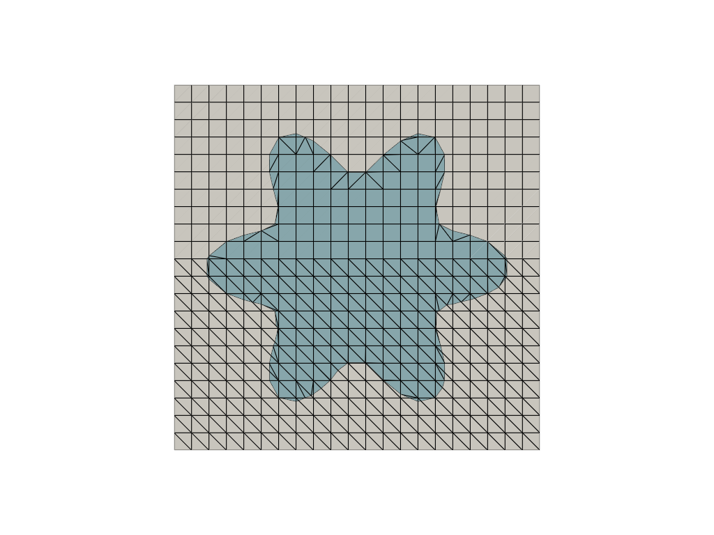
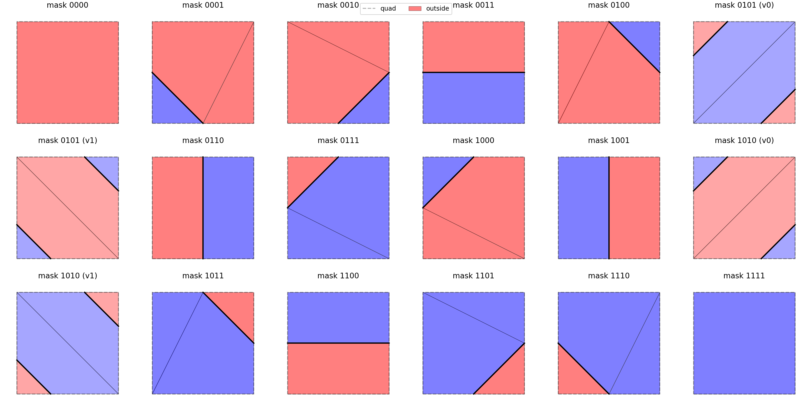
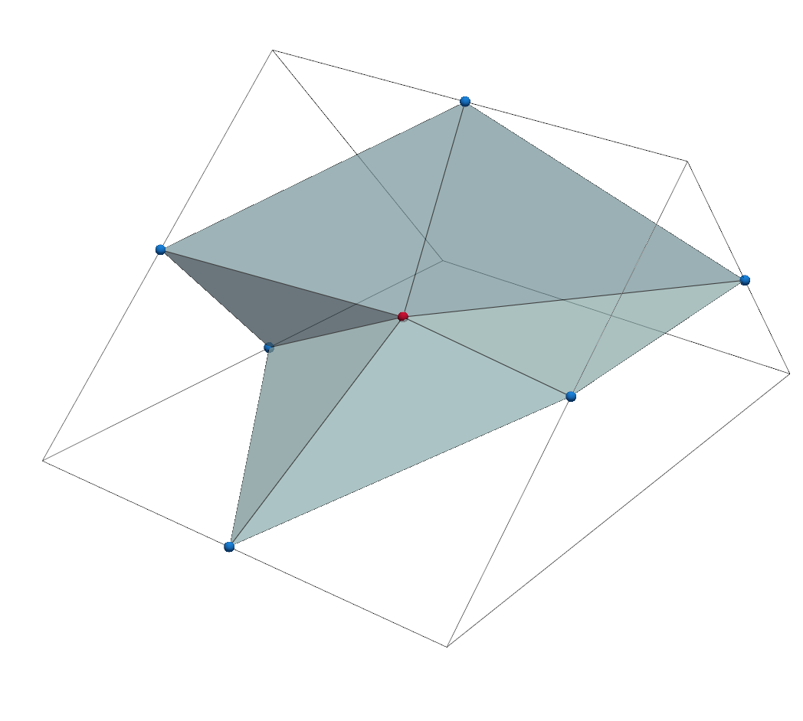
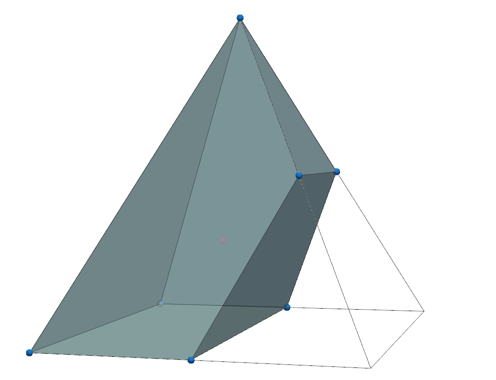
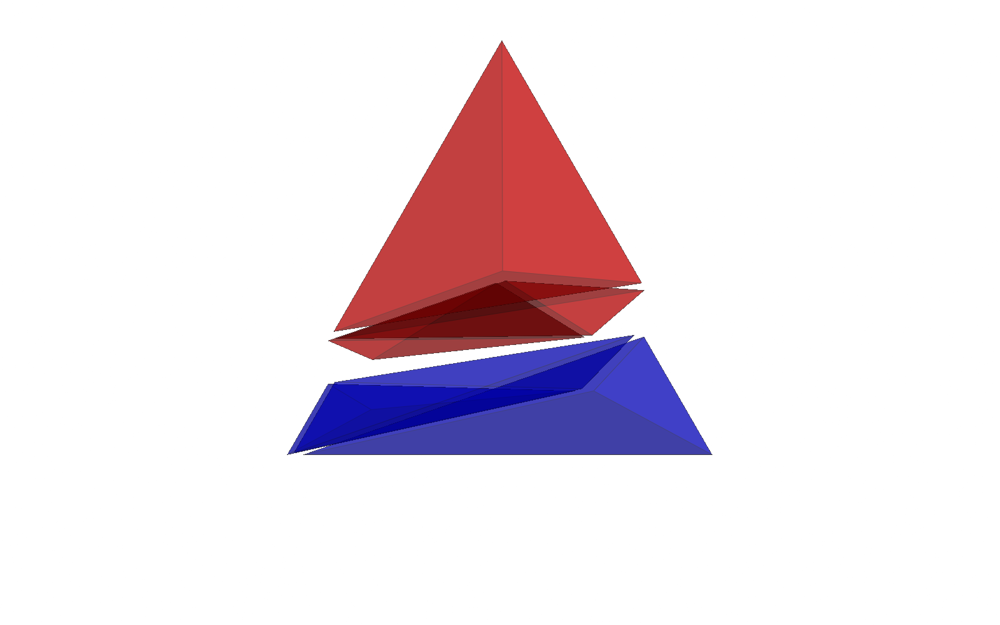
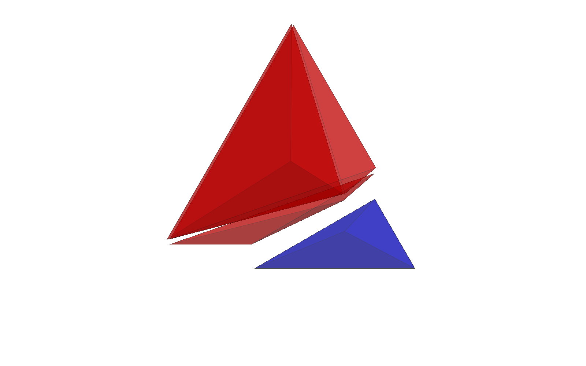
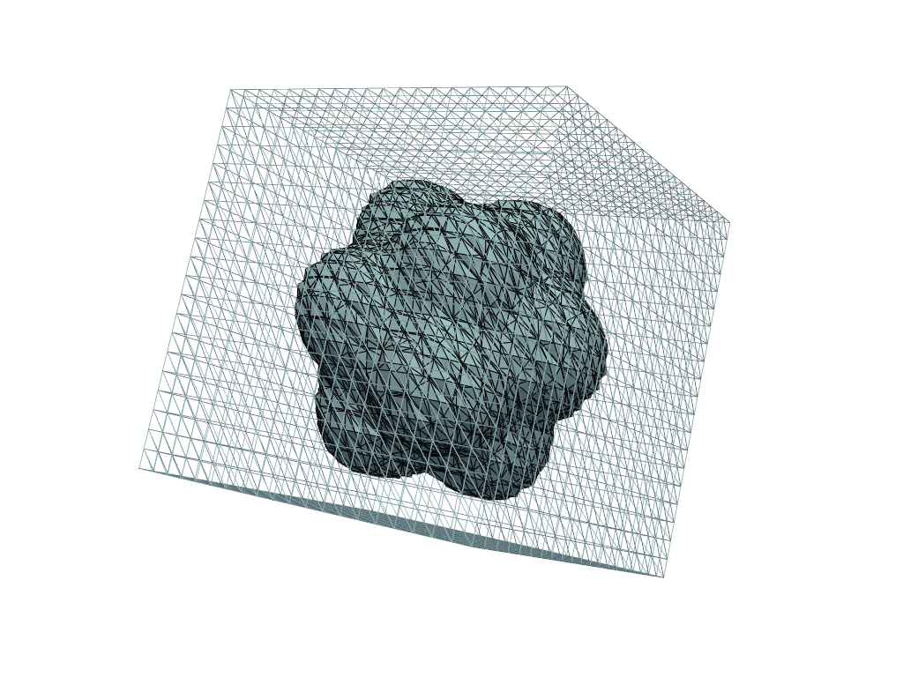
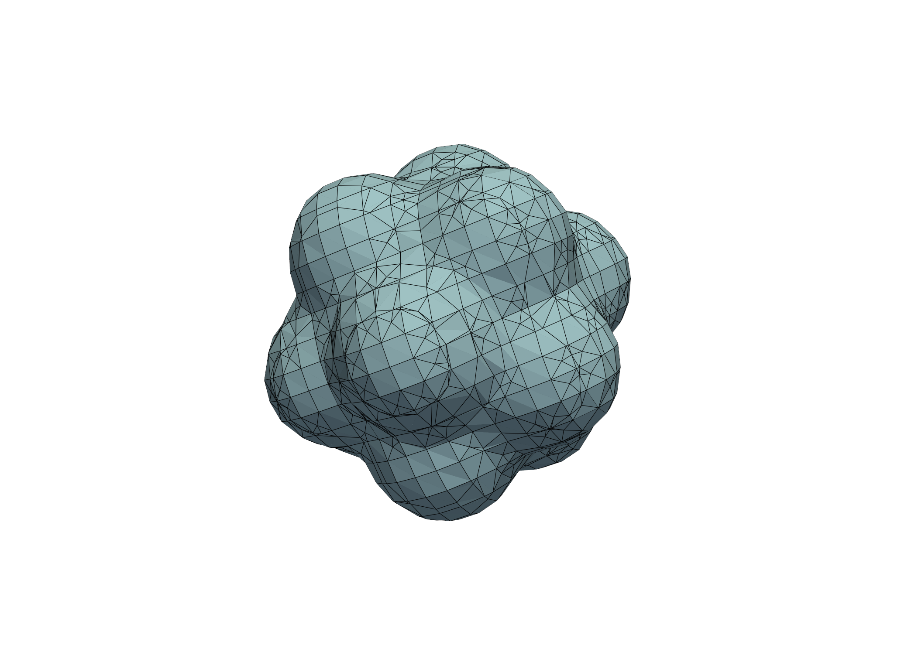
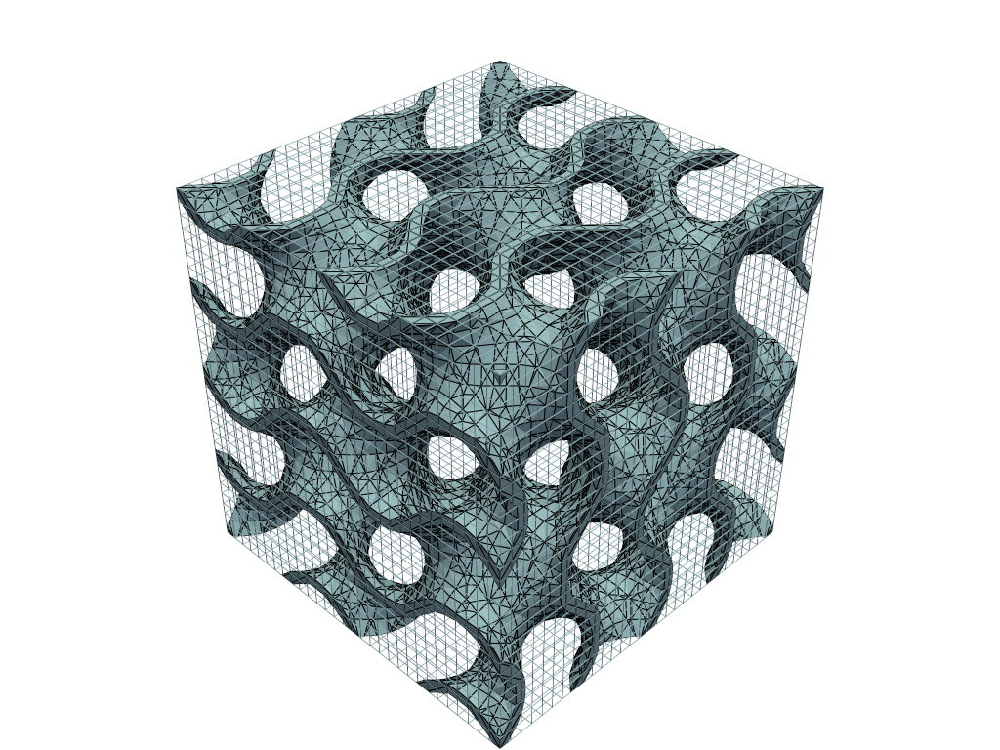

# CutCells

[](https://github.com/sclaus2/cutcells/actions/workflows/python-app.yml)


**CutCells** is a lightweight **C++20 geometry kernel with Python bindings** to compute **cut-cell decompositions** of standard mesh elements by an **implicit surface / level set** `φ(x)`.

Given one parent cell (or a whole mesh) and the level set values on its vertices, CutCells builds a **local sub-mesh** that describes:

* the **inside** region `φ < 0`,
* the **outside** region `φ > 0`,
* and/or the **interface** `φ = 0` (as facets/segments embedded in the cell),

with **explicit connectivity** and **element types**.

It is designed as a building block for **unfitted / immersed FEM** workflows (e.g. **CutFEM**), where robust cut geometry and stable parent mappings are required for runtime quadrature.

## Supported cell types

Current parent cell support:

* 1D: **interval**
* 2D: **triangle**, **quadrilateral**
* 3D: **tetrahedron**, **hexahedron**, **prism**, **pyramid**

Higher-order (currently pragmatic) support:

* **P2 triangle (6 nodes)** and **P2 tetrahedron (10 nodes)** via subdivision into linear sub-cells, cut, then merged back.

## Performance and dependencies

* **Few dependencies**: the computational core is plain C++.
* **Python bindings via nanobind**: CutCells exposes arrays in NumPy-friendly form and is designed to avoid unnecessary overhead.
* **Zero-copy where possible**: large buffers (coords, connectivity/offsets, parent IDs, provenance tags) are exposed as **views** when layout permits, minimizing memory traffic between C++ and Python.

## Applications

CutCells is intended as a reusable geometry backend for:

* **CutFEM / unfitted FEM**: robust sub-cell and interface extraction for integration on `Ω∩K` and `Γ∩K`
* **runtime quadrature** generation 
* general embedded geometry workflows where remeshing is undesirable

## Example gallery 


Below is a gallery of example outputs generated by CutCells and the provided Python demos. See `python/demo/` for scripts to reproduce these images.

<table>
	<tr>
		<td align="center">
			<br/>
			<sub>2D mesh cut by a circular level set</sub>
		</td>
        <td align="center">
			<br/>
			<sub>Hybrid mesh (quads+tris) cut by flower level set</sub>
		</td>
		<td align="center">
			<br/>
			<sub>Quad cases with disambiguation panels</sub>
		</td>
	</tr>
	<tr>
		<td align="center">
			<br/>
			<sub>Cut prism (wedge) demo</sub>
		</td>
		<td align="center">
			<br/>
			<sub>Cut pyramid demo</sub>
		</td>
        <td align="center">
			
            <br/>
			<sub>Cut tetrahedron demo</sub>
		</td>
	</tr>
	<tr>
		<td align="center">
			<br/>
			<sub>Tetrahedral mesh cut by a popcorn level set</sub>
		</td>
		<td align="center">
			<br/>
			<sub>Hexahedral mesh cut by popcorn level set</sub>
		</td>
        		<td align="center">
			<br/>
			<sub>Hexahedral mesh cut by gyroid level set</sub>
		</td>
	</tr>
</table>

# Installation

To install the CutCells library, first install the C++ library and then build the python interface

### C++ library

In the `cpp/` directory:

```console
cmake -DCMAKE_BUILD_TYPE=Release -B build-dir -S .
cmake --build build-dir
cmake --install build-dir
```

You may need to use `sudo` for the final install step. Using the CMake
build type `Release` is recommended for performance.


### Python interface

After installing the C++ library, install the Python interface by running in
the directory `python/`:

```console
cmake -DCMAKE_BUILD_TYPE=Release -B build-dir -S .
cmake --build build-dir
cmake --install build-dir
```

and then

```console
python3 -m pip install .
```

## Running demons

There are demons for both the C++ and the python interface.
For the C++ interface the demos are located in `cpp/demo`. The C++ demos are built with
```console
cmake -DCMAKE_BUILD_TYPE=Release -B build-dir -S .
cmake --build build-dir
cmake --install build-dir
```
in the corresponding demo folder, e.g. `cpp/demo/cut_triangle`

The python demos are located in `python/demo`.

## Third-party notices

Some generated clip/cut case tables (hexahedron/prism/pyramid) are derived from VTK's `vtkTableBasedClipCases.h`.
VTK's BSD-3-Clause license text is included in `third_party/VTK-Copyright.txt`.

## Dependencies

CutCells requires a C++20 compiler and depends on the C++ standard template library.
For the python interface, CutCells requires [`nanobind`](https://github.com/wjakob/nanobind).

At runtime for the python examples, CutCells requires [`numpy`](https://numpy.org) and [`pyvista`](https://pyvista.org/) for visualizations.

The library contains python `pytest` tests in `python/tests`.


