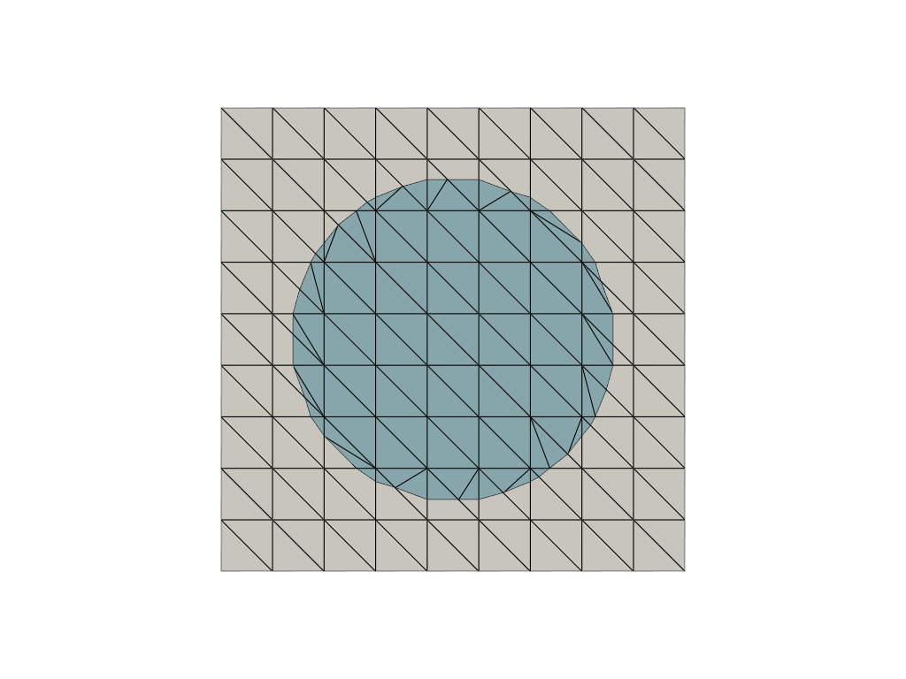
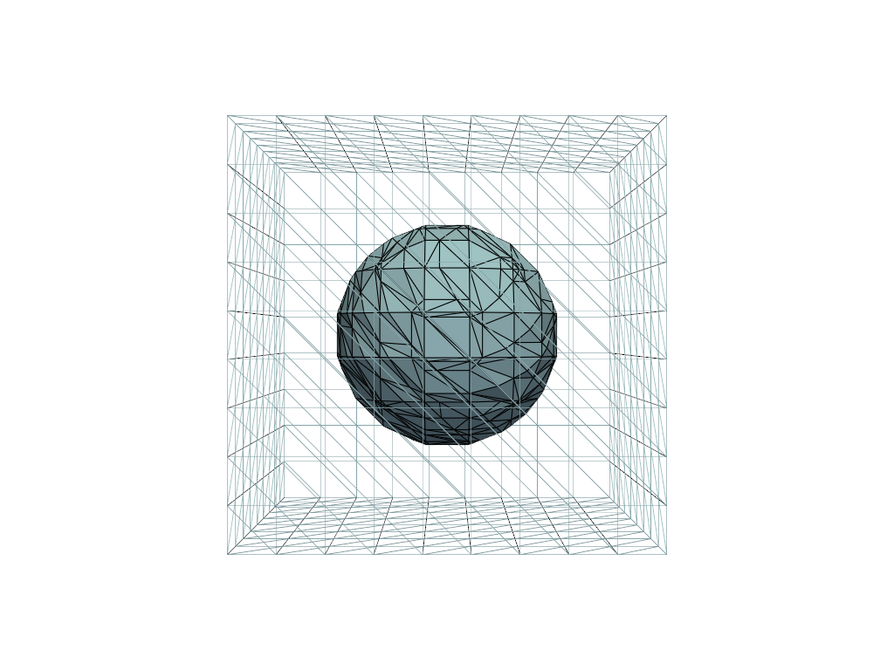

# CutCells

[](https://github.com/sclaus2/cutcells/actions/workflows/python-app.yml)

a library to compute intersections between mesh cells and implicit (level set) functions using marching cubes/tetrahedra algorithms. The current version supports intervals, triangles and tetrahedra. Future versions will include quadrilaterals, hexahedra, pyramids and prisms. This library is used as a basis for the computation of integrals in immersed boundary methods/cut finite element methods.






# Installation

To install the CutCells library, first install the C++ library and then build the python interface

### C++ library

In the `cpp/` directory:

```console
cmake -DCMAKE_BUILD_TYPE=Release -B build-dir -S .
cmake --build build-dir
cmake --install build-dir
```

You may need to use `sudo` for the final install step. Using the CMake
build type `Release` is strongly recommended for performance.


### Python interface

After installing the C++ library, install the Python interface by running in
the directory `python/`:

```console
cmake -DCMAKE_BUILD_TYPE=Release -B build-dir -S .
cmake --build build-dir
cmake --install build-dir
```

and then

```console
python3 -m pip install .
```

## Running demons

There are demons for both the C++ and the python interface.
For the C++ interface the demos are located in `cpp/demo`. The C++ demos are built with
```console
cmake -DCMAKE_BUILD_TYPE=Release -B build-dir -S .
cmake --build build-dir
cmake --install build-dir
```
in the corresponding demo folder, e.g. `cpp/demo/cut_triangle`

The python demos are located in `python/demo`.

## Dependencies

CutCells requires a C++20 compiler and depends on the C++ standard template library.
For the python interface, CutCells requires [`nanobind`](https://github.com/wjakob/nanobind).

At runtime for the python examples, CutCells requires [`numpy`](https://numpy.org) and [`pyvista`](https://pyvista.org/) for visualizations.

The library contains python `pytest` tests in `python/tests`.


