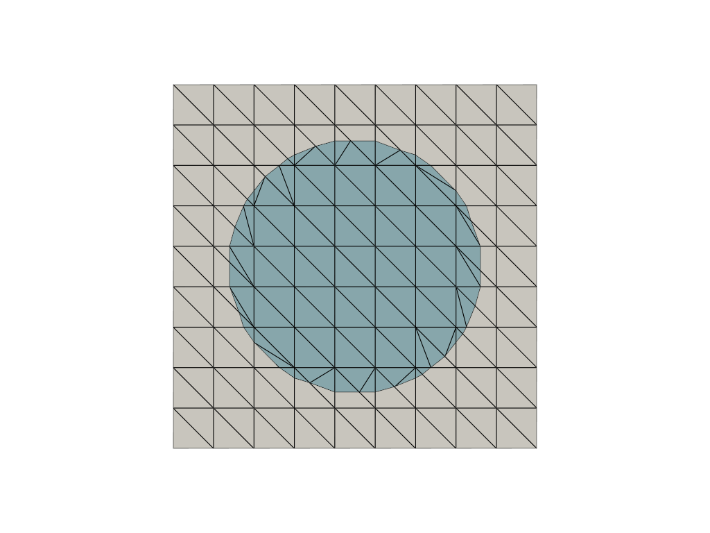
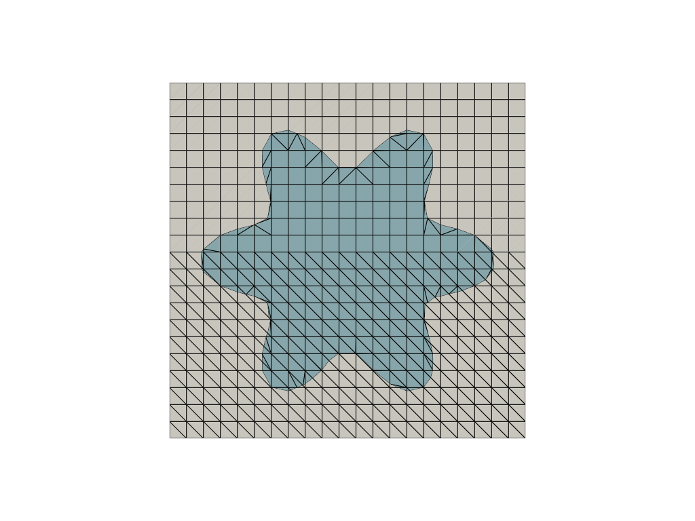
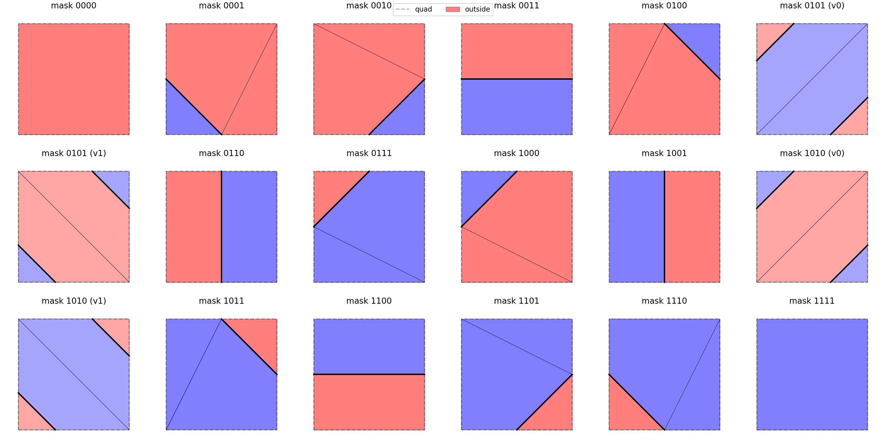
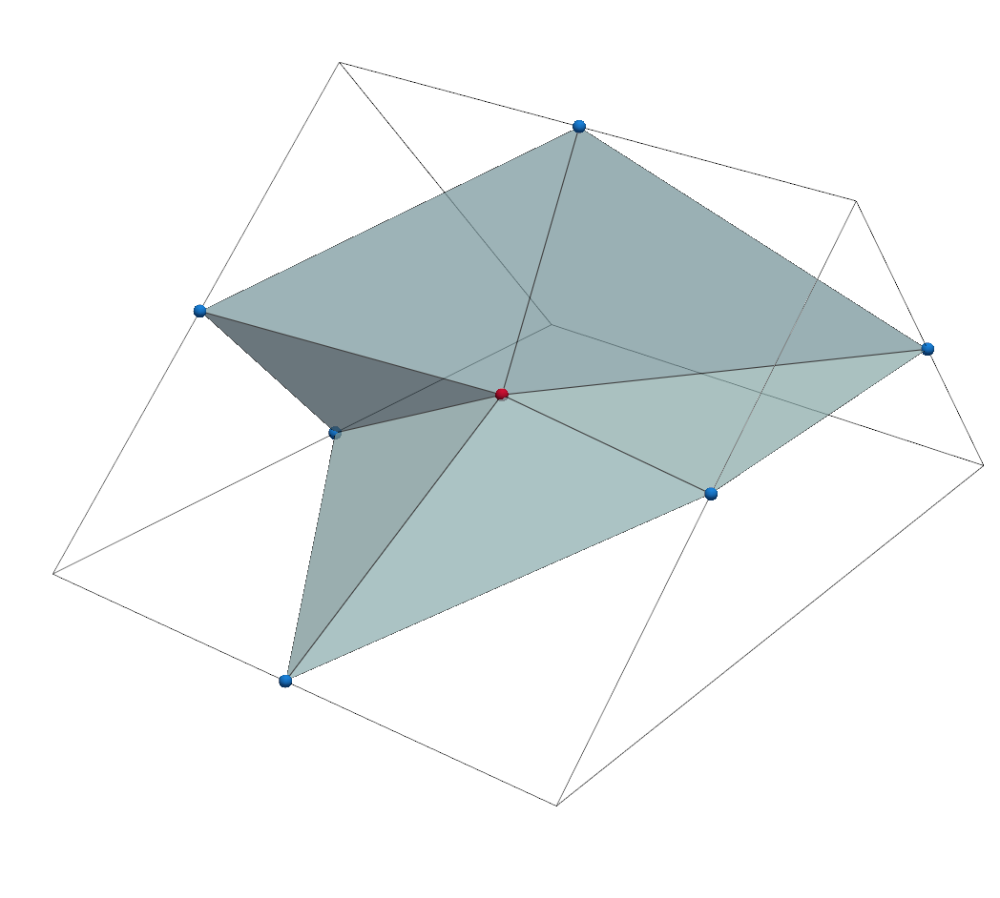
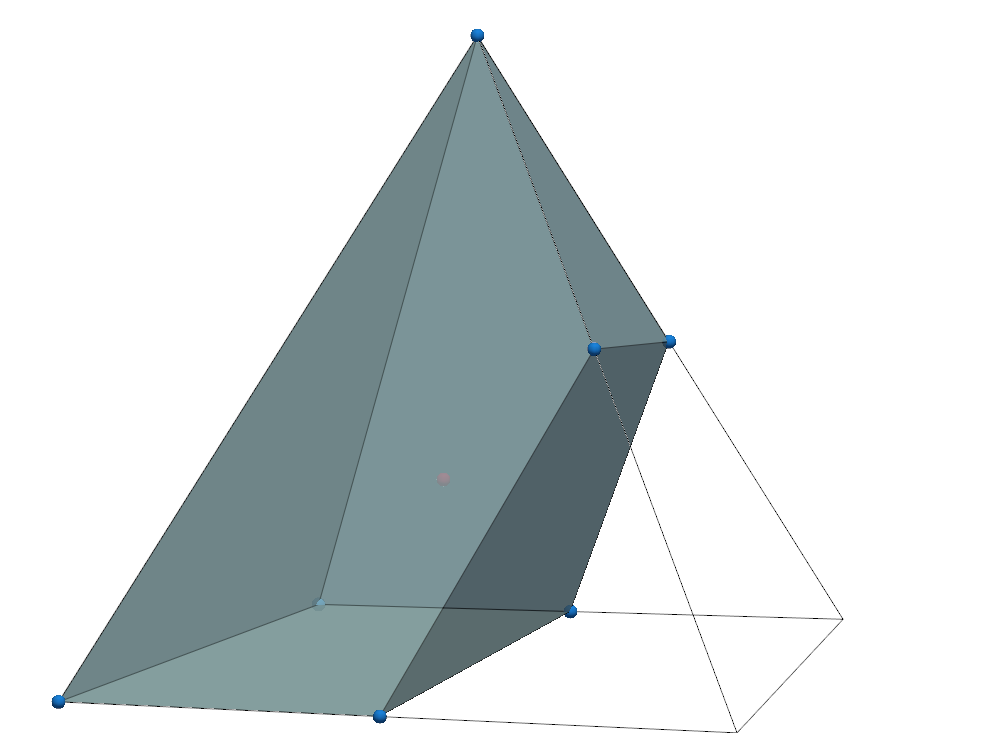
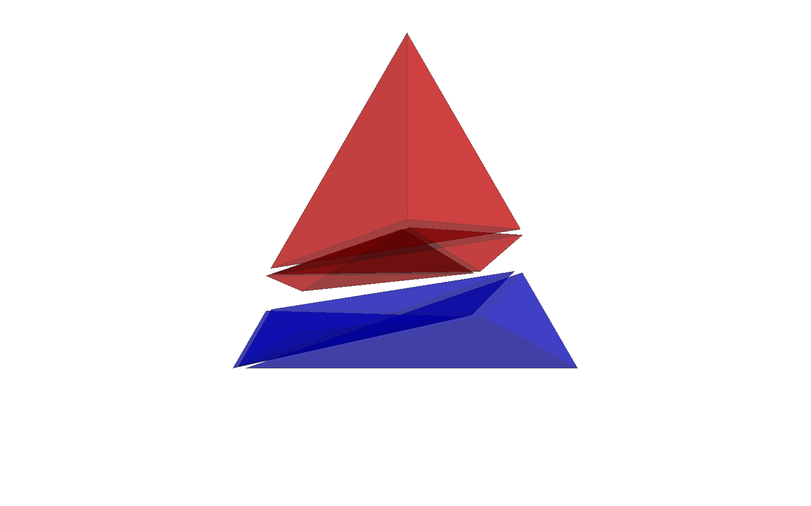
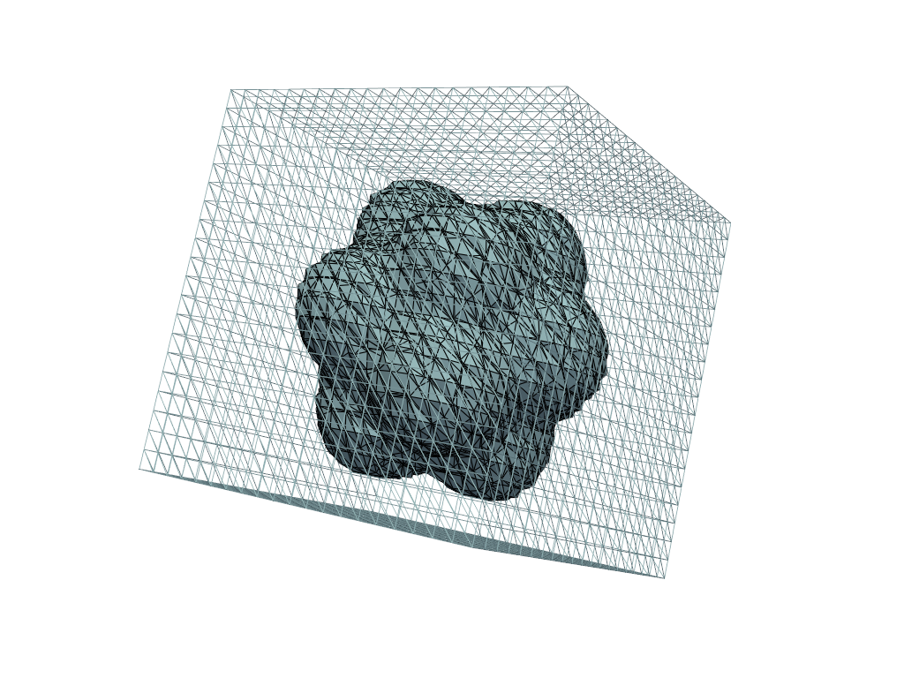
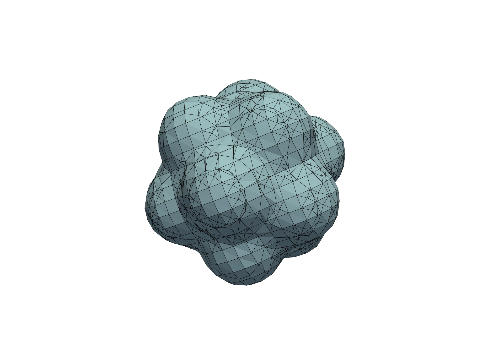
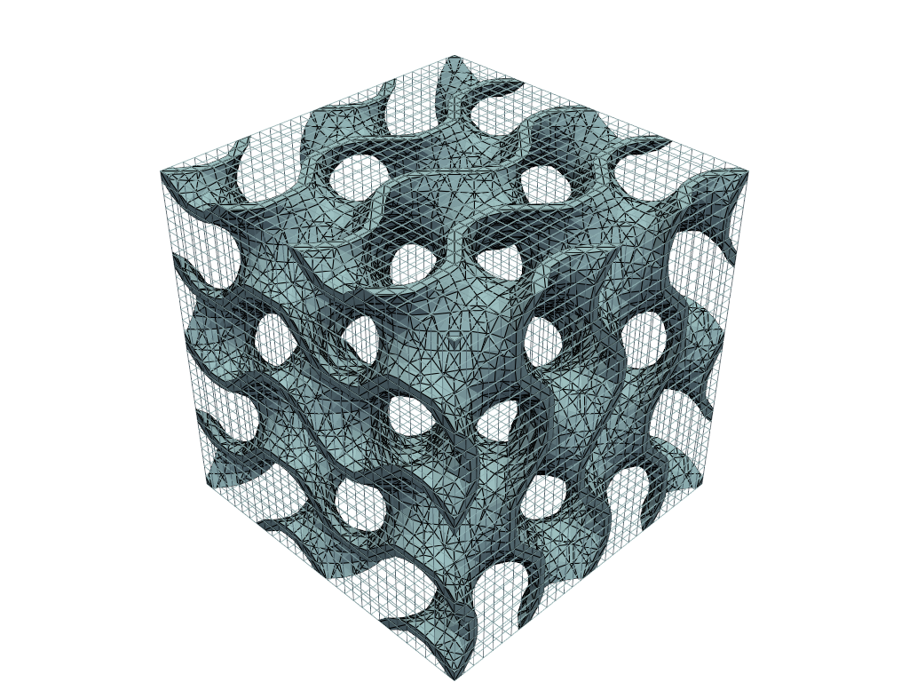

# CutCells

[](https://github.com/sclaus2/cutcells/actions/workflows/python-app.yml)


**CutCells** is a lightweight **C++20 geometry kernel with Python bindings** to compute **cut-cell decompositions** of standard mesh elements by an **implicit surface / level set** `φ(x)`.

Given one parent cell (or a whole mesh) and the level set values on its vertices, CutCells builds a **local sub-mesh** that describes:

* the **inside** region `φ < 0`,
* the **outside** region `φ > 0`,
* and/or the **interface** `φ = 0` (as facets/segments embedded in the cell),

with **explicit connectivity** and **element types**.

It is designed as a building block for **unfitted / immersed FEM** workflows (e.g. **CutFEM**), where robust cut geometry and stable parent mappings are required for runtime quadrature.

## Supported cell types

Current parent cell support:

* 1D: **interval**
* 2D: **triangle**, **quadrilateral**
* 3D: **tetrahedron**, **hexahedron**, **prism**, **pyramid**

Higher-order (currently pragmatic) support:

* **P2 triangle (6 nodes)** and **P2 tetrahedron (10 nodes)** via subdivision into linear sub-cells, cut, then merged back.

## Performance and dependencies

* **Few dependencies**: the computational core is plain C++.
* **Python bindings via nanobind**: CutCells exposes arrays in NumPy-friendly form and is designed to avoid unnecessary overhead.
* **Zero-copy where possible**: large buffers (coords, connectivity/offsets, parent IDs, provenance tags) are exposed as **views** when layout permits, minimizing memory traffic between C++ and Python.

## Applications

CutCells is intended as a reusable geometry backend for:

* **CutFEM / unfitted FEM**: robust sub-cell and interface extraction for integration on `Ω∩K` and `Γ∩K`
* **runtime quadrature** generation 
* general embedded geometry workflows where remeshing is undesirable

## Example gallery 


Below is a gallery of example outputs generated by CutCells and the provided Python demos. See `python/demo/` for scripts to reproduce these images.

<table>
	<tr>
		<td align="center">
			<br/>
			<sub>2D mesh cut by a circular level set</sub>
		</td>
        <td align="center">
			<br/>
			<sub>Hybrid mesh (quads+tris) cut by flower level set</sub>
		</td>
		<td align="center">
			<br/>
			<sub>Quad cases with disambiguation panels</sub>
		</td>
	</tr>
	<tr>
		<td align="center">
			<br/>
			<sub>Cut prism (wedge) demo</sub>
		</td>
		<td align="center">
			<br/>
			<sub>Cut pyramid demo</sub>
		</td>
        <td align="center">
			
            <br/>
			<sub>Cut tetrahedron demo</sub>
		</td>
	</tr>
	<tr>
		<td align="center">
			<br/>
			<sub>Tetrahedral mesh cut by a popcorn level set</sub>
		</td>
		<td align="center">
			<br/>
			<sub>Hexahedral mesh cut by popcorn level set</sub>
		</td>
        		<td align="center">
			<br/>
			<sub>Hexahedral mesh cut by gyroid level set</sub>
		</td>
	</tr>
</table>

# Installation

CutCells can be installed as a standalone C++ library and as a Python package.
For downstream packages such as CutFEMx, install the C++ core into the active
environment first, then build the Python extension against that installed CMake
package.

The following conda-forge workflow has been tested with FEniCSx 0.11:

```console
mamba create -n cutcells-dev -c conda-forge \
  python=3.12 cmake ninja pkg-config compilers \
  scikit-build-core nanobind numpy pytest
mamba activate cutcells-dev

export CONDA_PREFIX="${CONDA_PREFIX:?activate the conda environment first}"
export CMAKE_PREFIX_PATH="$CONDA_PREFIX"
export PYTHONNOUSERSITE=1
export CC="$CONDA_PREFIX/bin/clang"
export CXX="$CONDA_PREFIX/bin/clang++"
```

On macOS with conda-forge clang, also use:

```console
export CMAKE_ARGS="-DCMAKE_OSX_DEPLOYMENT_TARGET=13.4"
export CXXFLAGS="-D_LIBCPP_ENABLE_EXPERIMENTAL -D_LIBCPP_HAS_NO_EXPERIMENTAL_TZDB -D_LIBCPP_HAS_NO_EXPERIMENTAL_SYNCSTREAM -D_LIBCPP_HAS_NO_INCOMPLETE_PSTL"
```

Install the C++ core from the repository root:

```console
cmake -G Ninja -S cpp -B build/cutcells \
  -DCMAKE_BUILD_TYPE=Release \
  -DCMAKE_INSTALL_PREFIX="$CONDA_PREFIX" \
  -DCMAKE_PREFIX_PATH="$CONDA_PREFIX" \
  -DCMAKE_OSX_DEPLOYMENT_TARGET=13.4 \
  -DCUTCELLS_WITH_ALGOIM=ON
cmake --build build/cutcells --target install
```

On Linux, omit the `-DCMAKE_OSX_DEPLOYMENT_TARGET=13.4` line from the direct
CMake configure command.

Then install the Python package against that installed core:

```console
python -m pip install --no-build-isolation --no-deps --force-reinstall \
  ./python
```

Verify the install:

```console
python - <<'PY'
import cutcells
print("CutCells import ok:", cutcells.__file__)
PY
```

The Python package requires the installed CutCells C++ CMake package. Keep
`CMAKE_PREFIX_PATH` pointed at the active environment prefix so
`find_package(CutCells)` resolves the same library used by downstream packages.

## Running demos

There are demos for both the C++ and the Python interface.
For the C++ interface the demos are located in `cpp/demo`. The C++ demos are built with
```console
cmake -S cpp/demo/cut_triangle -B build/cut_triangle -DCMAKE_BUILD_TYPE=Release
cmake --build build/cut_triangle
```
from the repository root. If CutCells was installed into a custom prefix, pass
that prefix through `CMAKE_PREFIX_PATH`.

The Python demos are located in `python/demo`.

## Third-party notices

Some generated clip/cut case tables (hexahedron/prism/pyramid) are derived from
VTK's `vtkTableBasedClipCases.h`. VTK's BSD-3-Clause license text is included
in `third_party/VTK-Copyright.txt`.

Some generated quadrature lookup tables are produced offline with Basix
`make_quadrature`. Basix's MIT license text is included in
`third_party/Basix-LICENSE.txt`.

The optional Algoim quadrature backend vendors a pinned Algoim snapshot under
`third_party/algoim`. Algoim's license, upstream commit, and local patch notes
are included with the vendored copy. See `third_party/THIRD_PARTY_NOTICES.md`
for the consolidated notice list.

## Dependencies

CutCells requires a C++20 compiler and depends on the C++ standard template library.
For the python interface, CutCells requires [`nanobind`](https://github.com/wjakob/nanobind).

At runtime for the python examples, CutCells requires [`numpy`](https://numpy.org) and [`pyvista`](https://pyvista.org/) for visualizations.

The library contains python `pytest` tests in `python/tests`.

### Optional Algoim quadrature backend

CutCells vendors a pinned Algoim snapshot in `third_party/algoim`.
The default build does not use it. Configure with `-DCUTCELLS_WITH_ALGOIM=ON`
to enable the Algoim-backed quadrature backend:

```console
cmake -S cpp -B build/cutcells-algoim -DCUTCELLS_WITH_ALGOIM=ON
cmake --build build/cutcells-algoim
```

For the Python package, use the split install from the installation section:
enable Algoim in the C++ core, install that core into the active prefix, then
build the Python wrapper against the installed CMake package.

When Algoim is enabled, the build first looks for BLAS/LAPACK libraries under
`CMAKE_PREFIX_PATH`, which keeps conda-forge builds on the conda OpenBLAS stack
instead of accidentally picking Apple Accelerate on macOS. If needed, override
the libraries explicitly with `-DCUTCELLS_ALGOIM_LAPACK_LIBRARIES=...`.

The Python `HOMeshPart.quadrature` API keeps the existing straight backend as
the default. Request Algoim explicitly. The `algoim` backend uses Algoim's
Bernstein-polynomial quadrature path; `algoim_general` keeps the older callback
and interval path available for comparison:

```python
rules = result["phi < 0"].quadrature(order=4, mode="cut_only", backend="algoim")
surface = result["phi = 0"].quadrature(order=4, mode="cut_only", backend="algoim")
legacy = result["phi < 0"].quadrature(
    order=4, mode="cut_only", backend="algoim_general"
)
```

The Algoim backends support single-clause `phi < 0`, `phi > 0`, and `phi = 0`
selections on quadrilateral and hexahedral parent cells with Bernstein level-set
data. Unsupported selections fail with an explicit error rather than silently
falling back to the straight backend.
