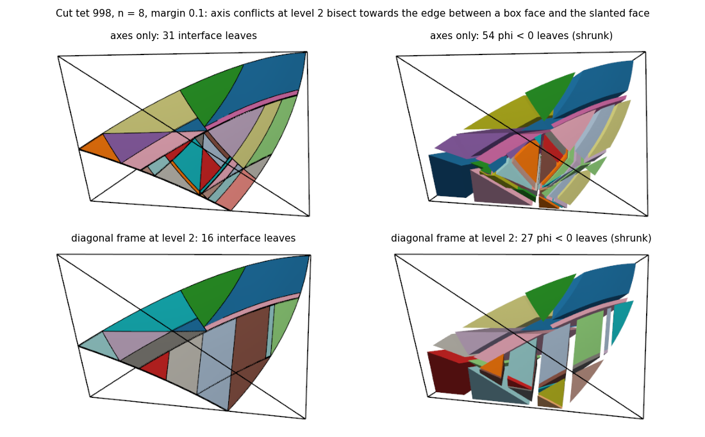

# Results

- v1.1: where the extra bisections on tets come from (at the end)
- v1: certify-and-bisect (below the v0 section)
- v0: algoim variants

## v0: algoim variants (2026-10-01)

Sphere of radius 0.7 with centre (0.0123, -0.0371, 0.0217), off the grid's
symmetry, in [-1, 1]^3. Gauss-Legendre everywhere unless the generator name says
`auto`. Each entry is per-cell L1 / worst cell, as defined in README.md.

### Interface, phi = 0

| Generator | Tet, n=16, q=3 | Tet, n=32, q=3 | Tet, n=16, q=5 | Tet, n=32, q=5 | Hex, n=16, q=5 | Hex, n=32, q=3 | Hex, n=32, q=5 |
| --- | --- | --- | --- | --- | --- | --- | --- |
| algoim-auto | 3.3e-4 / 3.8e-2 | 1.6e-5 / 2.4e-2 | 6.7e-5 / 1.5e-2 | 1.6e-6 / 3.4e-3 | 3.4e-9 / 8.6e-7 | 6.5e-6 / 2.2e-2 | 5.9e-7 / 2.1e-3 |
| algoim-gl | 2.5e-4 / 3.8e-2 | 6.9e-6 / 4.3e-3 | 6.1e-5 / 1.5e-2 | 6.3e-7 / 1.1e-3 | 3.4e-9 / 8.6e-7 | 3.9e-6 / 1.3e-2 | 9.3e-7 / 3.3e-3 |
| gl-cellmask | 6.0e-5 / 6.8e-3 | 4.7e-6 / 4.3e-3 | 2.9e-6 / 1.6e-3 | 3.9e-7 / 1.1e-3 | | | |
| alpha | 5.8e-5 / 4.9e-3 | 5.9e-6 / 4.3e-3 | 4.2e-6 / 7.5e-4 | 5.0e-7 / 1.1e-3 | 4.5e-8 / 2.1e-4 | 3.9e-6 / 1.3e-2 | 9.3e-7 / 3.3e-3 |
| split | 5.6e-5 / 6.8e-3 | 4.1e-6 / 4.3e-3 | 2.9e-6 / 1.6e-3 | 2.2e-7 / 1.1e-3 | 3.4e-9 / 8.6e-7 | 3.9e-6 / 1.3e-2 | 9.3e-7 / 3.3e-3 |
| alpha-split | 4.7e-5 / 4.9e-3 | 3.9e-6 / 4.3e-3 | 2.7e-6 / 7.5e-4 | 2.1e-7 / 1.1e-3 | 6.4e-9 / 9.6e-7 | 3.9e-6 / 1.3e-2 | 9.3e-7 / 3.3e-3 |
| quadgen | | | | | 3.4e-9 / 8.6e-7 | 9.3e-7 / 2.8e-3 | 6.9e-8 / 2.4e-4 |

On hexes `gl-cellmask` equals `algoim-gl` (no clip planes), so it is left out.

### Volume, phi < 0

| Generator | Tet, n=32, q=3 | Tet, n=32, q=5 | Hex, n=32, q=3 | Hex, n=32, q=5 |
| --- | --- | --- | --- | --- |
| algoim-auto | 6.6e-6 / 6.0e-2 | 9.8e-7 / 1.3e-2 | 2.4e-8 / 5.2e-5 | 2.4e-9 / 4.8e-6 |
| algoim-gl | 3.7e-8 / 6.2e-4 | 2.0e-10 / 4.9e-6 | 8.3e-9 / 3.3e-5 | 6.6e-11 / 1.9e-7 |
| gl-cellmask | 3.4e-8 / 6.2e-4 | 1.0e-10 / 4.9e-6 | | |
| alpha | 3.8e-8 / 6.2e-4 | 1.7e-10 / 4.9e-6 | 8.3e-9 / 3.3e-5 | 6.6e-11 / 1.9e-7 |
| split | 3.3e-8 / 6.2e-4 | 8.9e-11 / 4.9e-6 | 8.3e-9 / 3.3e-5 | 6.6e-11 / 1.9e-7 |
| alpha-split | 3.5e-8 / 6.2e-4 | 9.7e-11 / 4.9e-6 | 8.3e-9 / 3.3e-5 | 6.6e-11 / 1.9e-7 |
| quadgen | | | 7.7e-9 / 3.3e-5 | 8.9e-12 / 2.9e-8 |

### Cost at n = 32, q = 5

Points per cut cell for phi < 0 and phi = 0, and microseconds per cut cell for
phi = 0. Runs shared a loaded machine, so timings are rough.

| Generator | Tet points | Tet us | Hex points | Hex us |
| --- | --- | --- | --- | --- |
| algoim-auto | 370 / 38 | 916 | 224 / 32 | 360 |
| algoim-gl | 370 / 38 | 728 | 224 / 32 | 281 |
| gl-cellmask | 324 / 34 | 475 | | |
| split | 336 / 35 | 499 | 224 / 32 | 434 |
| alpha-split | 344 / 37 | 676 | 224 / 32 | 409 |
| quadgen | | | 224 / 32 | 25 |

`split` and `alpha-split` split 654 of 10,750 cut tets (6%) but only 9 of 2,354
cut hexes.

### Findings

1. **Drop AutoMixed.** With its tanh-sinh switch, volumes are much worse than
   with Gauss-Legendre at n = 32, q = 5: 10^4 times for tets (9.8e-7 against
   2.0e-10) and 36 times for hexes. Interfaces are mixed: tets up to 2.5 times
   worse, hexes 1.6 times better at q = 5.
2. **Restrict masks to the cell.** For tets this lowers the interface error 1.5
   to 21 times and saves 12% of the points.
3. **Use alpha to trigger splits, not to choose axes.** As an axis choice it
   hurts hexes (n = 16, q = 5: 3.4e-9 becomes 4.5e-8): sampled only where the
   interface crosses edges, it misses vertical tangents inside curved face
   traces. As a split trigger (`split`) it matches `alpha-split` on tets at
   q = 5, n = 32 (2.2e-7 against 2.1e-7, down from 3.9e-7 without splitting)
   and leaves hexes alone.
4. **The 2015 engine wins on hexes.** `quadgen` is 13 times better per cell for
   the interface and 7 times for the volume at n = 32, q = 5, and about 10 to 20
   times faster. Its interval test bisects whenever a vertical tangent may lie
   inside the box, which catches the tiny caps that every 2022-engine variant
   misses.
5. **What remains** are cells where the interface is nearly tangent to a face,
   in tets and hexes alike: worst cells of 1e-3 to 3e-3 at q = 5 (2.4e-4 with
   `quadgen`). Alpha does not see them, because their face traces are closed or
   strongly curved.

### Next candidates

1. **A certify-or-bisect engine with first-class clip planes**, in the style of
   the 2015 engine: certify a height direction on the clipped region with
   interval or Bernstein bounds and a margin, restrict the level set to clip
   planes by affine substitution, bisect otherwise. No resultants and no LAPACK.
   Finding 4 makes this the main candidate for the engine.
2. **Certification that sees tangent faces:** alpha plus a test for vertical
   tangents inside face traces.
3. **Transformed 1D rules near branch points** (sinh transformation, transplanted
   Gauss rules).
4. **Several level sets:** terms on more than one level set, e.g. with Beck and
   Kummer's nested height functions.

## v1: certify-and-bisect (2026-10-01)

Generator `certify:<margin>` (`src/certified.inl`): dimension reduction with clip
planes handled directly. At each level a height direction is accepted only if
every curved function satisfies |d_k psi| >= margin * |grad psi| on the box, from
Bernstein bounds; otherwise the box is bisected (up to 8 times per level). Margin
0 is plain certification, as in algoim's 2015 engine. Same sphere and metrics as
v0; "best v0" is `alpha-split` for tets and `quadgen` for hexes.

### Interface, phi = 0

| Generator | Tet, n=16, q=3 | Tet, n=32, q=3 | Tet, n=16, q=5 | Tet, n=32, q=5 | Hex, n=32, q=3 | Hex, n=32, q=5 |
| --- | --- | --- | --- | --- | --- | --- |
| best v0 | 4.7e-5 / 4.9e-3 | 3.9e-6 / 4.3e-3 | 2.7e-6 / 7.5e-4 | 2.1e-7 / 1.1e-3 | 9.3e-7 / 2.8e-3 | 6.9e-8 / 2.4e-4 |
| certify:0 | 8.0e-5 / 2.0e-2 | 3.6e-6 / 1.8e-3 | 9.1e-6 / 4.0e-3 | 1.4e-7 / 3.0e-4 | 9.3e-7 / 2.8e-3 | 6.9e-8 / 2.4e-4 |
| certify:0.1 | 2.2e-5 / 2.4e-3 | 1.6e-6 / 1.2e-3 | 6.1e-7 / 1.2e-4 | 1.4e-8 / 4.8e-5 | 9.3e-7 / 2.8e-3 | 6.9e-8 / 2.4e-4 |
| certify (0.25) | 3.9e-6 / 3.5e-4 | 7.0e-7 / 1.0e-3 | 1.7e-8 / 2.7e-6 | 2.4e-9 / 7.7e-6 | 1.9e-7 / 2.2e-4 | 1.3e-9 / 4.2e-6 |

### Volume, phi < 0

| Generator | Tet, n=32, q=3 | Tet, n=32, q=5 | Hex, n=32, q=3 | Hex, n=32, q=5 |
| --- | --- | --- | --- | --- |
| best v0 | 3.5e-8 / 6.2e-4 | 9.7e-11 / 4.9e-6 | 7.7e-9 / 3.3e-5 | 8.9e-12 / 2.9e-8 |
| certify:0 | 2.6e-8 / 3.1e-4 | 1.6e-10 / 3.1e-6 | 7.7e-9 / 3.3e-5 | 8.9e-12 / 2.9e-8 |
| certify:0.1 | 2.0e-8 / 8.4e-5 | 4.5e-11 / 6.9e-7 | 7.7e-9 / 3.3e-5 | 8.9e-12 / 2.9e-8 |
| certify (0.25) | 1.3e-8 / 7.2e-5 | 1.1e-11 / 2.1e-7 | 7.4e-9 / 3.3e-5 | 1.1e-12 / 2.9e-8 |

### Cost at n = 32, q = 5

| Generator | Tet points (vol / surf) | Tet bisections / uncertified | Hex points | Hex bisections |
| --- | --- | --- | --- | --- |
| best v0 | 344 / 37 | 654 splits | 224 / 32 | 0 |
| certify:0 | 448 / 46 | 463 / 0 | 224 / 32 | 8 |
| certify:0.1 | 474 / 49 | 2,122 / 109 | 224 / 32 | 8 |
| certify (0.25) | 594 / 63 | 9,534 / 716 | 226 / 32 | 31 |

There are 10,750 cut tets and 2,354 cut hexes. Time per cut cell was 100 to 440
us, against 280 to 730 us for the 2022 engine (and 25 us for `quadgen`, which
evaluates the sphere analytically).

### Plane exactness

With `--plane` (phi = x + 0.3 y - 0.2 z) every variant reproduces the volume and
area totals to 1.4e-14 or better, on tets (n = 4 and 7) and hexes (n = 5): the
clip-plane handling is exact.

### Findings

1. **A margin removes the outliers.** Margin 0 reproduces `quadgen`. Margin 0.25
   improves hexes 50 times (interface, n = 32, q = 5) while bisecting 1.3% of
   cut cells, and tets 90 times over the best v0 generator. Tets end within 2
   times of hexes per cell (2.4e-9 against 1.3e-9); nothing is left of the 3D
   surface stall.
2. **The price is points on tets:** 1.7 times the volume points of the best v0
   generator at margin 0.25, 1.4 times at 0.1. Many bisections come from
   functions that do not matter, such as the level set restricted to a box face
   the tet only touches at a vertex. Pruning dominated bounds is the next step.
3. **Uncertified leaves** (depth limit) remain where a restricted function has a
   singular point, i.e. a face tangent to the sphere. Their roots are isolated
   in full, so they lose accuracy only locally.
4. **No resultants and no LAPACK in the decision logic.** LAPACK is used only by
   algoim's Bernstein interpolation for the bounds; exact conversion matrices
   can replace it.
5. **Coarse meshes bisect a lot at margin 0.25** (n = 6: about 15 bisections per
   cut tet), because cells are as large as the curvature radius. The margin
   could follow q and the cell size.

### With dominated bounds pruned

Bounds that are never active on the base region are now dropped (option
`prune_bounds`, on by default; checked at the vertices of the base polytope, since
bounds are affine). Plane exactness still holds (1.7e-14 or better). Tets at
n = 32, q = 5, interface and volume (per-cell L1 / worst cell), and points per
cut tet:

| Generator | Interface | Volume | Points (vol / surf) | Bisections / uncertified |
| --- | --- | --- | --- | --- |
| best v0 (`alpha-split`) | 2.1e-7 / 1.1e-3 | 9.7e-11 / 4.9e-6 | 344 / 37 | 654 splits |
| certify:0.1, pruned | 2.7e-8 / 6.7e-5 | 6.8e-11 / 4.1e-6 | 350 / 37 | 1,990 / 109 |
| certify (0.25), pruned | 3.0e-9 / 7.7e-6 | 1.5e-11 / 5.3e-7 | 469 / 51 | 9,056 / 715 |

Pruning cuts 21 to 26% of the points at about the same accuracy. At the cost of
the best v0 generator, `certify:0.1` is 8 times more accurate per cell for the
interface, with a 16 times smaller worst cell. Margin 0.25 buys another 9 times
for 1.36 times the points. Hexes have no clip planes and are unchanged.

### Next steps

1. Find where the remaining bisections come from: done in v1.1.
2. Leaf-cell visualisation: done, see VISUALIZATION.md.
3. Several level sets: selection terms on more than one level set.
4. Exact Bernstein conversion instead of interpolation (no LAPACK).
5. Prisms and pyramids: more clip planes from their reference cells.

## v1.1: where the extra bisections on tets come from (2026-10-01)

At margin 0.25 (n = 32, q = 5) tets needed 9,056 bisections, and 715 boxes
reached the depth limit, against 31 bisections for hexes. `quadrature_study
--diagnose` now records every failed certification: its level, the function
with the smallest margin, what a 9^D sample of the clipped region says about
that function, and whether one function fails on every axis or each function
has an axis but no axis suits all of them (a conflict).

### Causes

Tets, n = 16, q = 5, margin 0.25, interface (5,322 bisections and 217 boxes at
the depth limit):

| Failed certifications | Count |
| --- | --- |
| level 2, conflict between phi on a box face and phi on the slanted face | 2,970 bisections and all 217 depth-limit boxes |
| level 2, one function fails on every axis | 819 |
| level 3, phi fails on every axis | 1,533 |

**Conflicts at the slanted face.** With height direction u_k at level 3, the
base of a tet is the triangle u_i, u_j >= 0, u_i + u_j <= 1. Two of its
functions are phi on the bottom face (u_k = 0) and phi on the slanted face
(u_k = 1 - u_i - u_j). Their zero curves meet on the hypotenuse, under the edge
the two faces share. When the reference normal of the sphere is close to
(e_i + e_k)/sqrt(2), the first curve needs u_i as height direction and the
second needs u_j. Bisection never separates two curves that meet, so the boxes
shrink towards the meeting point until the depth limit.

Example, tet 3688 (n = 16): phi on the bottom face has margins (0.02, 0.62) on
the two axes, phi on the slanted face (0.63, 0.08). Eight bisections later, in a
box touching the hypotenuse, they are (0.18, 0.97) and (0.96, 0.23). The cell
ends with 9 bisections, one uncertified box and 250 points.

Hexes have no slanted face: phi on the bottom and on the top face give nearly
parallel curves, and hexes bisect about 1% of their cut cells.

**Fix: a diagonal frame at level 2** (`CertifyOptions::diagonal_frames`, on by
default). If no axis certifies, the level-2 problem is rewritten in
z = (y0 + y1, y1 - y0): the box becomes four clip planes and the functions are
composed with the linear map, so the rest of the engine is unchanged. With four
directions 45 degrees apart, two nearly straight curves always leave a usable
direction while the margin is below sin(22.5 degrees) = 0.38. The frame also
certifies quarter arcs, whose normals span 90 degrees.

In tet 3688 both functions have margins above 0.5 along (1, 1). The cell then
needs no bisection and 75 points, with an error of 2.1e-13.

Tets, n = 32, q = 5 (per-cell L1 / worst cell; points per cut tet):

| Variant | Interface | Volume | Points (vol / surf) | Bisections / uncertified |
| --- | --- | --- | --- | --- |
| best v0 (`alpha-split`) | 2.1e-7 / 1.1e-3 | 9.7e-11 / 4.9e-6 | 344 / 37 | 654 splits |
| certify (0.25), axes only (v1) | 3.0e-9 / 7.7e-6 | 1.5e-11 / 5.3e-7 | 469 / 51 | 9,056 / 715 |
| certify:0.1, diagonal frame | 2.6e-8 / 6.7e-5 | 6.4e-11 / 4.1e-6 | 328 / 35 | 113 / 0 |
| certify (0.25), diagonal frame | 2.2e-9 / 7.7e-6 | 1.2e-11 / 5.3e-7 | 366 / 39 | 604 / 0 |

The diagonal frame removes 93% of the bisections and every depth-limit box. It
saves 22% of the points, and the result is slightly more accurate. For the
interface, 1,882 level-2 boxes use it.

Compared with the best v0 generator, margin 0.25 now costs 6% more points. Its
per-cell error is 95 times smaller on the interface (worst cell 140 times) and
8 times smaller on the volume. Margin 0.1 needs fewer points than v0 and is
still 8 times better on the interface.

Tets end within 1.7 times of hexes per cell (2.2e-9 against 1.3e-9). Hexes are
unchanged, with 25 bisections instead of 31. Runs made together took 386
instead of 677 us per cut tet (volume).

Plane exactness still holds (1.6e-14 or better), also with the diagonal frame
forced on every level-2 box.

One cell gets worse on the coarse n = 8 mesh with q = 3 and margin 0.1: the
worst volume cell, a cap of 0.7% of its tet, goes from 1.1e-3 to 5.0e-3. The
diagonal frame certifies it without bisection, with 27 points instead of 81.
Its error converges with q as expected: 2.4e-5 at q = 5, with 125 points.

### What remains: bounds over the whole box

Of the 604 bisections left at n = 32, 190 are at level 3 (phi itself) and 398
at level 2 where one function fails on every axis; 16 are conflicts. For most of
them, sampling finds the margin satisfied near the zero set inside the cell
(166 of 190 at level 3, 323 of 414 at level 2). The Bernstein bounds cover the
whole box, which for a tet is 6 times the cell. For a Kuhn tet the box is a
parallelepiped up to 3.7 h across, against 1.7 h for a hex of the same grid.

`mask_subdivisions = M` certifies on M^D sub-cells instead, counting only those
that meet the cell and on which the function may vanish. That still guarantees
at most one root per height line. With M = 4 almost all of these bisections go
(604 to 70), but they were not wasted: the margin also sets the accuracy.

| Variant (n = 32, q = 5, diagonal frame) | Interface | Volume | Points (vol / surf) | Bisections / uncertified |
| --- | --- | --- | --- | --- |
| box bounds, margin 0.25 | 2.2e-9 / 7.7e-6 | 1.2e-11 / 5.3e-7 | 366 / 39 | 604 / 0 |
| masked (M = 4), margin 0.25 | 9.8e-9 / 1.1e-5 | 3.0e-11 / 2.2e-6 | 335 / 36 | 70 / 0 |
| masked (M = 4), margin 0.4 | 1.8e-9 / 7.7e-6 | 1.1e-11 / 1.1e-6 | 375 / 40 | 553 / 9 |
| masked (M = 4), margin 0.5 | 6.7e-10 / 7.7e-6 | 4.2e-12 / 3.0e-7 | 469 / 50 | 3,462 / 209 |

At the same number of points, masked bounds are about as accurate as box bounds
(margin 0.4 against 0.25), with a worse worst volume cell.

Take the worst masked cell at n = 16, tet 8236, with an interface error of
1.4e-4 at q = 5:

- The rule is right: the error falls exponentially with q (3.3e-3, 1.4e-4,
  8.4e-6, 5.6e-7 for q = 3, 5, 7, 9), so the integrand has a nearby
  singularity.
- The error sits in the outermost 1D integral. Splitting each segment there into
  four Gauss pieces gives 1.5e-7; splitting the level-2 segments changes
  nothing.
- Box bounds bisect this cell twice and reach 1.9e-11.
- Counting sub-cells up to half a box away from the cell did not help.

Conclusion: keep bounds over the whole box (`mask_subdivisions = 1`, the
default) and the diagonal frame. The margin is the accuracy control, not only a
correctness test. A cheaper accuracy control would have to judge the outer 1D
integrand directly; only then would masked bounds pay off.

### Next steps

1. Several level sets: selection terms on more than one level set.
2. Exact Bernstein conversion instead of interpolation (no LAPACK).
3. Prisms and pyramids: more clip planes from their reference cells.
4. An accuracy control for the outer 1D integral, so that certification can use
   masked bounds.
5. Binary VTK output for larger leaf meshes.
