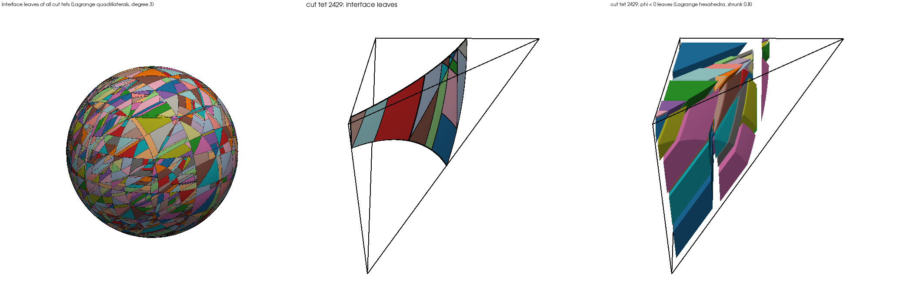

# Visualising cuts from the quadrature engine

Today `HOMeshPart` gets its visualisation mesh from AdaptCell's sub-cells
(`part.write_vtu(...)`, straight or curved). The new engine produces quadrature
points only, so it needs its own visual output. The recommendation is to draw the
cut from the engine's own decomposition: what you see is then exactly what is
integrated.

## 1. Point clouds (implemented)

`quadrature_study --vtk <prefix>` writes every rule as a VTK point cloud (`.vtu`,
VTK_VERTEX cells) with point data `weight` and `cell`, one file per generator,
part, n and q. In ParaView, colour by `weight` or glyph by it.

Use it to check that points stay inside the cell and the selected part, to see
where bisection concentrates points, and to find cells with too few points. Files
are ASCII and grow with the point count (n = 6, q = 3, certify: 36 MB for
phi < 0); binary output is the next step for larger runs.

## 2. Leaf cells of the decomposition (implemented)

Left: interface leaves of all cut tets. Middle and right: one cut tet with its
interface leaves and its phi < 0 leaves (shrunk to 0.8). Sphere of radius 0.7,
Kuhn tets with n = 8, degree 3.

The engine already parametrises every piece it integrates. A volume leaf is a
column over a column over an interval:

- x1 in [a, b], an interval of the 1D level;
- x2 in [L2(x1), U2(x1)], one segment of the level-2 height line;
- x3 in [L3(x1, x2), U3(x1, x2)], one segment of the level-3 height line.

Each bound is a box face, a clip plane or a root of a level set, and the
decomposition guarantees that the same bounds apply across the whole leaf. The
quadrature rule is the image of a Gauss-Legendre grid under the leaf's map;
`certified_leaves` runs the same recursion with p + 1 equispaced nodes per
segment instead. These are the nodes of a degree-p Lagrange hexahedron
(VTK_LAGRANGE_HEXAHEDRON). An interface leaf is the graph of the root of phi
over a level-2 leaf: a Lagrange quadrilateral (VTK_LAGRANGE_QUADRILATERAL).
ParaView, VTK 9 and pyvista render both as curved cells.

How it works:

- Every emitted point carries a tag: per level, the certified box, the segment
  along the height line and the node within the segment. Leaves are assembled
  from the tags, and their nodes reordered into VTK's Lagrange order.
- Leaf nodes sit 1e-5 of the segment inside its ends. Right at a breakpoint a
  root lies on a bound, and rounding can put it on either side; that left 1.5% of
  the leaves with missing nodes at an inset of 1e-7.
- Hexahedra are oriented to a positive Jacobian, interface quadrilaterals to a
  normal along grad phi.
- A volume leaf lies on one side of each level set, so a part is the set of
  leaves whose signs satisfy the selection term (decided from the mean of phi
  over the leaf's nodes).

Usage: `quadrature_study --gen certify:0.1 --part "phi < 0" --part "phi = 0"
--leaves <prefix> [--leaf-degree p]` writes per part the leaves of every cut
cell (plus, for volume parts, the uncut cells as linear cells), and the cut
background cells. `tools/check_leaves.py render` draws the figure above.

Checks (n = 8, Kuhn tets, margin 0.1):

- **Node order:** `test_leaf_ordering` writes cells whose nodes sit at their own
  parametric coordinates. With VTK 9.6, `tools/check_leaves.py ordering` finds
  that VTK's interpolation is the identity to 1e-16, for hexahedra and
  quadrilaterals of degrees 1 to 4.
- **Geometry:** all 45,536 interface-leaf nodes lie on the sphere to 3.3e-16, and
  every volume-leaf node is inside the ball.
- **Coverage:** VTK's own cell sizes, summed, converge to the exact values as the
  degree grows. VTK measures curved cells by linear subdivision through their
  nodes, so the difference falls like 1/p^2: volume 2.7e-3, 7.1e-4, 2.0e-4 and
  area 1.8e-3, 4.5e-4, 1.4e-4 for p = 2, 4, 8. No incomplete leaves and no
  negative-size cells.

What the pictures show: 627 cut tets give 2,846 interface leaves (4.5 per cut
tet) and 5,371 volume leaves (8.6). The tet in the figure has 20 interface and 45
volume leaves, with thin strips crowding one corner: the decomposition is finer
than the geometry needs. That is the same effect that costs extra quadrature
points, and the leaf view is the tool to find where it comes from.

Caveats:

- Leaves are columns aligned with the chosen height directions. They do not
  conform across cells; that is fine for display.
- Segments shrink to zero at tangencies and where three bounds meet, giving
  collapsed cells; display is fine.
- Files are ASCII: n = 8, degree 3, phi < 0 has 345,000 nodes.

## 3. Whole meshes and the Python side

Uncut cells are exported as themselves, straight or curved by their geometry map,
and cut cells as their leaves per part, in one `.vtu` (or VTKHDF) per part, as
`HOMeshPart.write_vtu()` offers today. The binding can also return
`(points, connectivity, offsets, cell_types)` arrays for
`pyvista.UnstructuredGrid`, zero-copy like the other bindings.

This answers one of the hand-off note's open questions: if the engine draws its
own leaves, AdaptCell is not needed for visualisation, and the picture can never
disagree with the quadrature.
